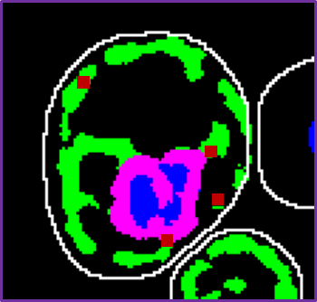

# smFISH mRNA-organelle Statistical Analysis Tool

The data collected concerns signals given from a specific mRNA molecule and each molecule's relative localization to a studied sub-cellular site (also called organelle). The Data also devides the organelle to two distinct areas. One of which is close to a proximity marker and another that is far away from it. The data represients each cell as a line and contains the amount of mRNA in each designation, the cellular coverage of the organelle in each cross-section imaged (in %) and data for each mRNA signal identifed. mRNA data inclueds the plane number, the intesity and the colocalization status of each mRNA signal. Each csv file contains data for a single sample.

This program will be used to perform filtering and statistical analysis for csv files containing said data. The input data will be in the following format:

- **Cell #**: The designated number for the cell represented in the row.
- **Total mRNA per Cell**: The number of mRNA signals identified in the cell.
- **Total Colocolized With Irgnalle Near/Far**: The number of mRNAs designated as colocalized near/far a proximity marker.
- **Total Not Colocolized with Organelle**: The number of mRNAs designated as not colocolized with the organelle.
- **Organelle Signal Coveraege of Cell List**: A list with the cellular coverage (in %) of the organelle in each cross-section imaged.
- **mRNAs z coords**: The z-plane location of each mRNA signal in the cell.
- **mRNAs intesities**: The intesity value for each mRNA signal in the cell.
- **mRANAs statis**: The colocalization designation for each mRNA signal in the cell.

In each image, cells are analyzed and their data is collected.

In a cell (as seen above) several types of signals can be found. They include the red spots, which are the locations of mRNA molecules, the green and magenta area, which mark a specific site whithin the cell called ER and the blue signal, which is another cellular site called the nucleus. For my research, the ratio of mRNA signals :red_circle: that are on the same location as the ER signal :four_leaf_clover: :cherry_blossom: is important. The changes in this data point between different strains are also important.

### The goal of the tool is as follows:
- The tool will be given a folder and will work sequentially on all files in the folder.
- Filter out cells containing 0 mRNA signals.
- Filter out specific mRNA signals using user inputed values of organelle signal coverage and mRNA intesities.
- Create a new, filtered table, withouth the signals and cells that were removed.
- Perform statistical analysis on the filtered data, including average localization ratios for each file (and error values), anove test between each sample.
- Create and output a file with the statistical analysis data between all samples.
- Output a grpah for the colocalization data (violin plots).

### Dependencies:
- See requierments.txt file.

### How-to:
To run the program you will need a folder containing the files described above. The program can handle any number of files. Each file will represent a single sample from the smFISH experiment.
Once you run the program (simply run mRNA_orgnalle_colo.py) you will be prompted to input the folder with the files, the number of samples in the experiment (an int), a name for each sample (will appear in the graphs and tables), and a distinct name for the file of each sample (will be used to identify the file in the folder). The file name needs to be a part of the file for that sample and must not be a part of any other file in the folder. It will be case sensitive.
Remember to press the 'Enter' buttons after you input the ids or names.

To see a violing plot of the data after filtartion (colocalizaion ratio for each sample). The plot is also saved by defualt in the same folder as the rest of produced tables.

This project was created as part of the [Python programming course](https://github.com/szabgab/wis-python-course-2024-04) at the [Weizmann Institute of Science](https://www.weizmann.ac.il/) taught by [Gabor Szabo](https://szabgab.com/).
